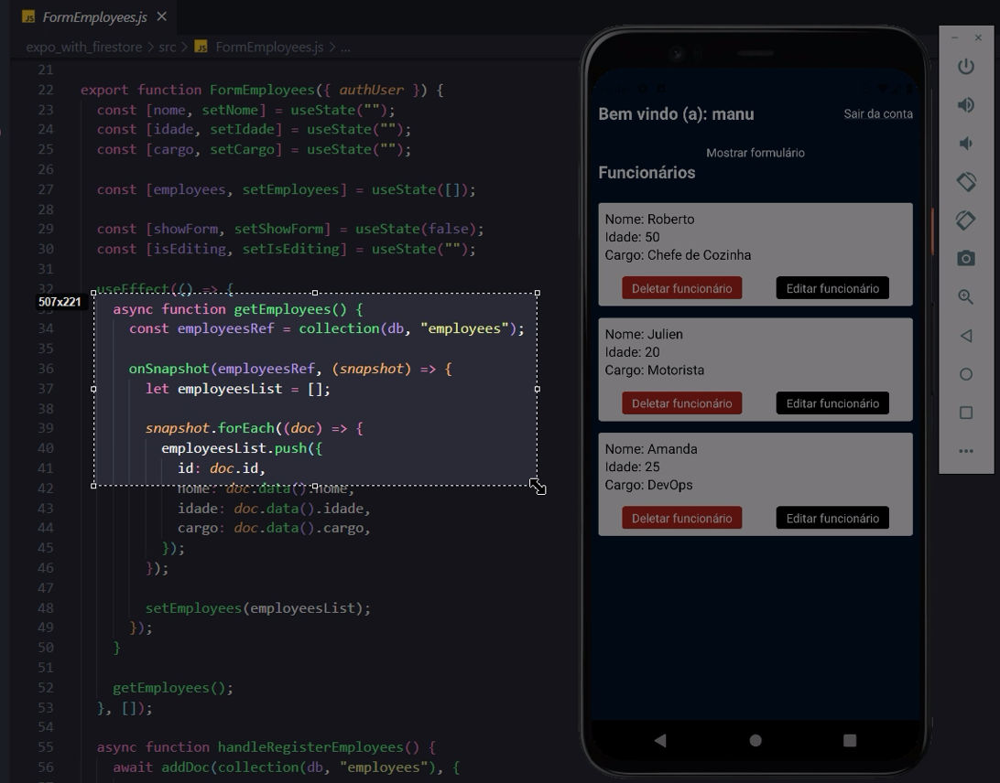

# Estudos Firebase


## Firestore Database
### Cloud Firestore

- Banco de dados não-relacional
- Baseado em Coleções e Documentos
> **Ex.: Na Coleção Users** => \
> Cada usuário é um documento!

### Com Doc Ref

- Busca uma única vez e encerra a conexão

```jsx
// Com document reference

const docRef = doc(db, "nomeDoDoc", "idDoDoc")

getDoc(docRef).then((snapshot) => {
	const data = snapshot.data();
})
```

### Com Snapshot - Realtime

- Observer - “Olheiro”

```jsx
// Com snapshot - Realtime

const docRef = doc(db, "nomeDoDoc", "idDoDoc")

onSnapshot(docRef, (doc) => {
	const data = doc.data();
})
```

