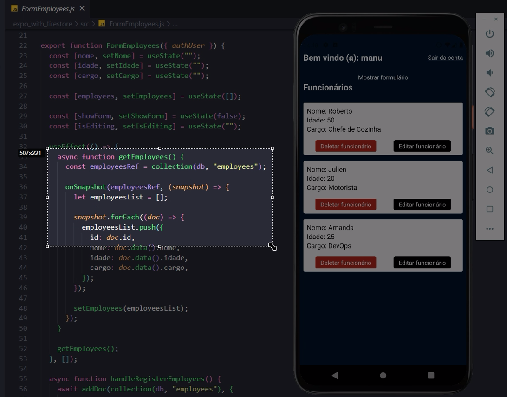

### Firebase Authentication
- [x] createUserWithEmailAndPassword
- [x] signInWithEmailAndPassword

- [x] signOut

### Firestore Database
- [x] doc
- [x] collection

- [x] onSnapshot

- [x] addDoc

- [x] updateDoc

- [x] deleteDoc

